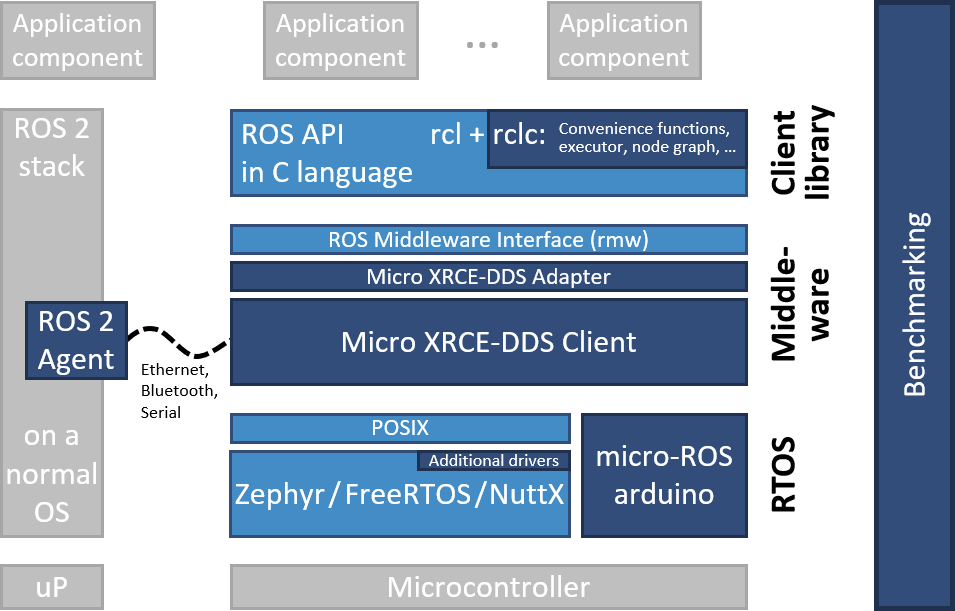
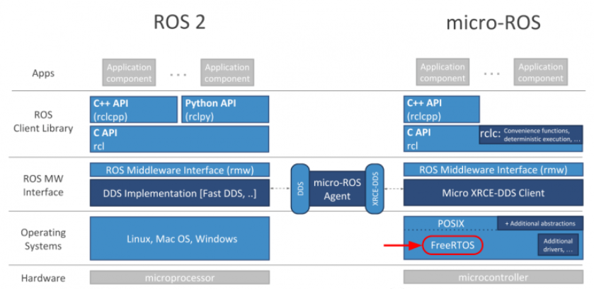

# ROS-MCU Communication

## Hardware Setup
> 1. ROS(Robot Operating System)
>> 主机：PC/Virtual Machie
>>
>> 系统：Ubuntu Desktop 20.04 LTS
>
> 2. MCU(Micro Control Unit)
>> 主机：MCU
>>
>> 系统：FreeRTOS
>
> 3. Communication Bus
>> 接口：USB-Serial
>>
>> 协议：RS485

## Communication Method
> 1. MCU(FreeRTOS + micro-ROS)
>> 在MCU的FreeRTOS上运行micro-ROS以实现与ROS2其他节点进行通讯。micro-ROS允许开发人员在硬件级别附近运行ROS2节点，这使所有硬件外设都可用于该应用程序，从而使其能够直接与SPI或I²C等低级总线进行交互，以与传感器和执行器接口。micro-ROS是一组分层的库，它们可以直接重用ROS2的库，也可以使其适应资源受限设备的功能和需求。
>> micro-ROS的框架如下图所示。
>>
>> Reference: 
>> [1] https://micro.ros.org/ 
>> [2] https://micro.ros.org/docs/overview/features/ 
>> [3] https://micro.ros.org/docs/tutorials/core/first_application_rtos/freertos/ 
>> [4] https://github.com/micro-ROS 
>> [5] https://blog.csdn.net/ybhuangfugui/article/details/108613008 
>> [6] https://docs.ros.org/en/galactic/index.html 
>> [7] https://github.com/ros2 
>> [8] https://blog.csdn.net/amuro_ray027/article/details/117807412 
>
> 2. MCU(FreeRTOS + Data Encoder/Decoder(Protocol)) + PC(Ubuntu + ROS + rosserial)
>> 根据定制的通讯协议将电机驱动和状态请求的数据通过串口进行传输，然后在上位机和控制器两端对数据进行编解码，从而实现控制指令和状态请求。 
>> 上位机驱动：
>>
>> 控制器数据编解码器：
>>
>
> 3. MCU(FreeRTOS + roslib) + PC(Ubuntu + ROS + rosserial)
>> 通过roslib将MCU抽象成ros的一个节点，roslib可以帮助完成与其他节点的通讯，数据序列化及消息服务的订阅和发布等功能。 
>> 上位机节点：
>>
>> 控制器节点：
