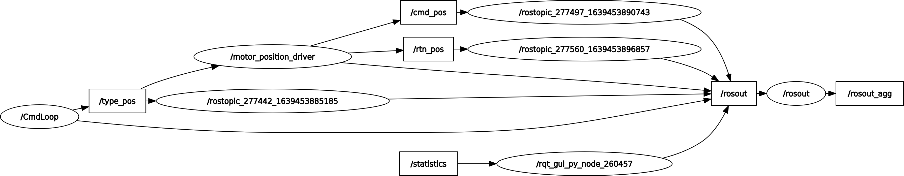

# ROS-Motor Communication

## 1.ROS-Motor Interface
> (1) 创建串口
>> 指定端口，波特率等通讯相关配置
>>```python
>>ser = serial.Serial(port='/dev/ttyUSB0', baudrate=115200, bytesize=8, parity='N', stopbits=1, timeout=2, rtscts=True, dsrdtr=True)
>>```
> (2) 创建节点、发布器及订阅器
>>```python
>> rospy.init_node('motor_position_driver', anonymous=False)
>>pub_cmd = rospy.Publisher('cmd_pos', String, queue_size=10)
>>pub_rtn = rospy.Publisher('rtn_pos', String, queue_size=10)
>>rospy.Subscriber('type_pos', String, CmdCallback, (pub_cmd, pub_rtn), queue_size=10)
>>```
> (3) 处理（读写）串口数据
>>```python
>>def CmdCallback(data, args):
>>    rospy.loginfo("Hex cmd data: %s", data.data)
>>    args[0].publish(data.data)  # pub_cmd
>>    send_data = bytes.fromhex(data.data)
>>    ser.write(send_data)
>>    receive_data = ser.readall().hex()
>>    rospy.loginfo("Hex rtn data: %s", receive_data)
>>    args[1].publish(receive_data)  # pub_rtn
>>```
> (4) ROS Graph
>> 

## 2.type_pos Loop
> (1) 手动发布
>> rostopic pub -1 /type_pos std_msgs/String -- "4154068F4446500000AA"
>>
> (2) 自动发布
>> 交替发布90和180度的转角
>>```python
>>def CmdLoop():
>>    rospy.init_node('CmdLoop', anonymous=False)
>>    pub = rospy.Publisher('type_pos', String, queue_size=10)
>>    rate = rospy.Rate(0.25)  # 2Hz
>>    count = 0
>>    type_pos_cmd1 = "4154068F4446500000AA"
>>    type_pos_cmd2 = "4154068F442328000071"
>>    while not rospy.is_shutdown():
>>        if count % 2 == 0:
>>            # By-hand command: rostopic pub -1 /type_pos std_msgs/String -- "4154068F4446500000AA"
>>            rospy.loginfo("type_pos_loop: %s", type_pos_cmd1)
>>            pub.publish(type_pos_cmd1)
>>        else:
>>            rospy.loginfo("type_pos_loop: %s", type_pos_cmd2)
>>            pub.publish(type_pos_cmd2)
>>        rate.sleep()
>>        count += 1
>>```
